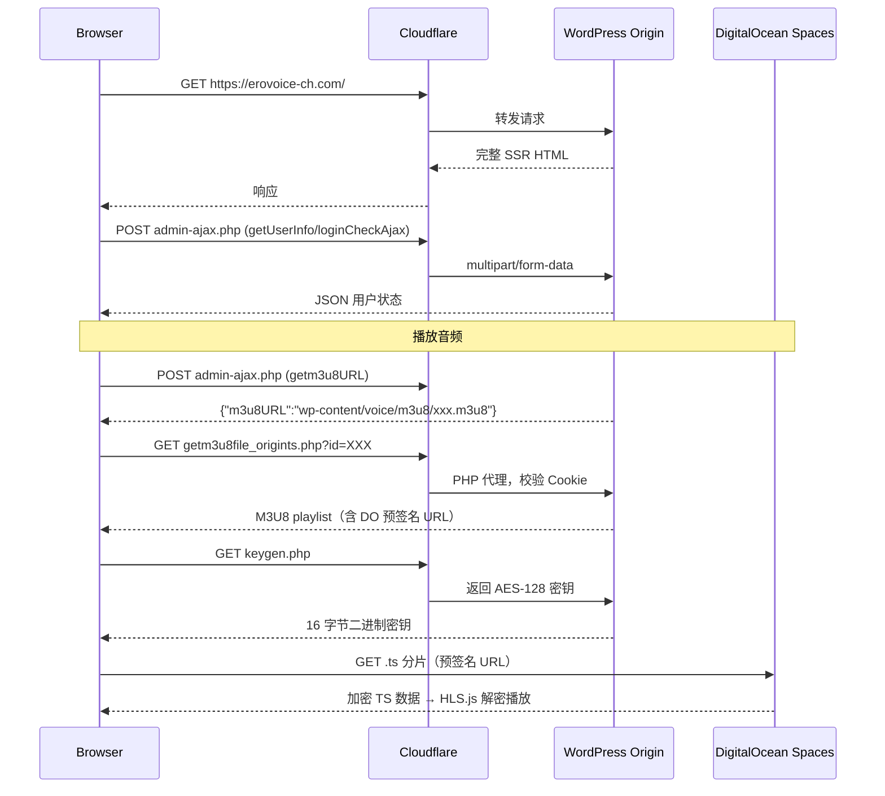

# EroVoice-ch.com 逆向分析技术文档

> 分析日期：2026-07-11  
> 目标站点：https://erovoice-ch.com/  
> 测试账户：poiyee  
> 角色：generaluser (UserID: 5146)

---

## 目录

1. [整体架构](#一整体架构)
2. [认证机制](#二认证机制)
3. [页面数据来源](#三页面数据来源)
4. [API 整理](#四api-整理)
5. [作品数据模型](#五作品数据模型)
6. [作者数据模型](#六作者数据模型)
7. [媒体资源](#七媒体资源)
8. [反爬机制](#八反爬机制)
9. [Provider 架构建议](#九provider-架构建议)

---

## 一、整体架构

### 1.1 技术栈

| 组件 | 技术 |
|------|------|
| CMS | WordPress |
| 主题 | 自研主题 `erovoice-ch` |
| 渲染模式 | **SSR**（服务端渲染为主） |
| 前端框架 | 原生 JavaScript + jQuery |
| 音频播放 | green-audio-player (自定义) + HLS.js |
| 直播 | HLS (m3u8) + HLS.js |
| 音频存储 | DigitalOcean Spaces（S3 兼容对象存储） |
| 媒体 CDN | `data.erovoice-ch.com`（独立子域名，Cloudflare 代理） |
| 推送通知 | Service Worker + Web Push API |
| 分析 | Google Analytics (G-XE2LT33ZRJ) |

### 1.2 渲染模型

**核心原则：SSR 优先，AJAX 增强。**

- **首次加载**：所有主要内容（语音列表、作品详情、作者资料、搜索结果）由 WordPress 服务端渲染为完整 HTML
- **动态内容**：通过 `admin-ajax.php` POST 请求加载评论、用户状态、点赞、关注等
- **无限滚动**：作者作品列表、收藏、关注列表使用 IntersectionObserver + AJAX 懒加载
- **评论轮询**：每 5 秒 AJAX 轮询获取新评论

### 1.3 请求流程



---

## 二、认证机制

### 2.1 认证类型

| 方式 | 说明 |
|------|------|
| 表单登录 | 标准 WordPress 登录 |
| OAuth2 | X (Twitter) OAuth2 集成 |
| Cookie Session | PHPSESSID + wordpress_logged_in |

### 2.2 表单登录流程

**端点：** `POST https://erovoice-ch.com/wp-login.php`

**请求体（application/x-www-form-urlencoded）：**

```
log=poiyee
pwd=666666%40wAp
rememberme=forever
wp-submit=ログイン
redirect_to=https://erovoice-ch.com/wp-admin/
```

**成功后的 Cookies：**

| Cookie | 值示例 | 属性 |
|--------|--------|------|
| `PHPSESSID` | `f278fa686f3b9f3ea61579765cbb323d` | Session, **非 HttpOnly** |
| `wordpress_logged_in_68345c91832ea5dca0c30b9996831fbd` | `poiyee%7C1815301101%7C...` | 持久化, HttpOnly, Secure |
| `wordpress_test_cookie` | `WP%20Cookie%20check` | Session, HttpOnly |

> `PHPSESSID` 为非 HttpOnly，JavaScript 可读取。`wordpress_logged_in` 为 HttpOnly。

### 2.3 登录状态检测

**getUserInfo 响应（已登录）：**

```json
{"status":"success","sexSelect":"未登録","userNicename":"poiyee","displayName":"poiyee","role":"generaluser","userID":5146}
```

**loginCheckAjax 响应（已登录）：**

```json
{"status":"logined","userID":5146,"userName":"poiyee","userRole":"generaluser"}
```

### 2.4 X (Twitter) OAuth2

```
https://twitter.com/i/oauth2/authorize?response_type=code
  &client_id=ZDVMejNKTXBpTHh6ZGFuYzBINzM6MTpjaQ
  &redirect_uri=https://erovoice-ch.com/registration.html?callback=twitter
  &scope=offline.access tweet.read tweet.write users.read
  &code_challenge_method=plain
```

### 2.5 AJAX 请求头规范

```
X-Requested-With: XMLHttpRequest
Content-Type: multipart/form-data; boundary=----WebKitFormBoundaryXXX
Accept: */*
Origin: https://erovoice-ch.com
Referer: https://erovoice-ch.com/{current_page}
```

---

## 三、页面数据来源

### 3.1 首页

| 项目 | 说明 |
|------|------|
| URL | `GET /` |
| 渲染 | SSR |
| XHR | `getUserInfo`(×3), `loginCheckAjax`, `setting.json` |
| 内容 | 新着音声、人気作品、作者列表全部在 HTML 中 |

### 3.2 作品列表

**URLs：** `/voice`, `/category/ero-voice`, `/category/ero-asmr`, `/category/moe-asmr`

**参数：** `page`（服务端分页，如 `/voice/page/2/`）

**渲染：** 全部 SSR，每项含封面、标题、标签、统计、作者

### 3.3 作品详情

**URL：** `/ero-voice/{postID}.html` / `/ero-asmr/{postID}.html` / `/moe-asmr/{postID}.html`

**XHR：**

| Action | 参数 | 响应 |
|--------|------|------|
| `getCommentAjax2` | `postID`, `afterID` | `{status, html, latest_id, count}` |
| `custoAccessCount` | `nonce`, `postviews_id` | 浏览量更新 |
| `viewLiveUserIcon` | `ajax=true` | 直播用户图标 |

**互动（点击触发）：**

| Action | 说明 |
|--------|------|
| `add_bookmark` | 收藏/取消 |
| `addUserFollow/removeUserFollow` | 关注 |
| `commentAjaxFunc` | 提交评论 |
| `ajaxAuthorlike` | 评论点赞 |

### 3.4 作者页

**URL：** `GET /{username}`

**无限滚动 AJAX：**

| 参数 | 值 |
|------|-----|
| action | `getSQLDataAuthorPostData` |
| items | `50` |
| start | `0`, `50`, `100`... |
| userName | 作者 slug |

**响应：** `{"status":"success","getDatas":"<li>...HTML...</li>","end":true/false}`

### 3.5 搜索

**URL：** `GET /allsearch.html`

**搜索提交：** `GET /` 带查询参数

| 参数 | 值 | 说明 |
|------|-----|------|
| `category` | `all`/`ero-asmr`/`moe-asmr`/`ero-voice` | 分类 |
| `sort` | `new`/`view`/`like`/`comment` | 排序 |
| `s` | 关键词 | 自由搜索 |

**特殊页面：** `?type=taglist`（标签列表）, `?type=userlist`（作者列表）

**渲染：** 全部 SSR

### 3.6 排行榜

**URL：** `GET /ranking.html` — 全部 SSR

### 3.7 收藏 / 关注

| 类 | Action |
|----|--------|
| `bookmarkScrollGetData` | `getSQLDataBookmarkPostData` |
| `followListScrollGetData` | `getSQLDatafollowslistPostData` |
| `followersListScrollGetData` | `getSQLDatafollowerslistPostData` |

### 3.8 评论

- **提交：** `commentAjaxFunc`（AJAX）或 `wp-comments-post.php`
- **加载：** `getCommentAjax2` / `ajaxGetComment`
- **轮询：** 5 秒间隔，自动刷新

---

## 四、API 整理

**通用端点：** `POST https://erovoice-ch.com/wp-admin/admin-ajax.php`

**通用请求：** multipart/form-data, X-Requested-With: XMLHttpRequest

**通用响应：** JSON `{status: "success"|"failed"|"none"|"logined", ...}`

### 4.1 Public API（无需登录）

| Action | 参数 | 响应 |
|--------|------|------|
| `loginCheckAjax` | — | `{status, userID?, userName?, userRole?}` |
| `getUserInfo` | — | `{status, userID?, displayName?, role?, sexSelect?}` |
| `viewLiveUserIcon` | `ajax=true` | `{status, result}` |
| `getCommentAjax2` | `postID, afterID` | `{status, html, latest_id, count}` |
| `ajaxGetComment` | `postID, contentID, flag, nowCommentIDs` | 评论列表 |
| `custoAccessCount` | `nonce, postviews_id` | `{status, postid, newCount}` |

### 4.2 Private API（需登录）

| Action | 关键参数 | 说明 |
|--------|----------|------|
| `add_bookmark` | `postID` | 收藏/取消收藏 |
| `addUserFollow` | `userID` | 关注用户 |
| `removeUserFollow` | `userID` | 取消关注 |
| `commentAjaxFunc` | `commentNonce, commentID, comment, postID` | 提交评论 |
| `ajaxAuthorlike` | `commentID, toggleLike` | 点赞评论 |
| `getSQLDataAuthorPostData` | `items, start, userName` | 作者作品列表 |
| `getSQLDataBookmarkPostData` | `items, start, userID` | 收藏列表 |
| `getSQLDatafollowslistPostData` | `items, start, userID` | 关注列表 |
| `getSQLDatafollowerslistPostData` | `items, start, userID` | 粉丝列表 |
| **`getm3u8URL`** | `postid` | **`{m3u8URL: "wp-content/voice/m3u8/xxx.m3u8"}`** |
| `get_notice_count` | — | 通知数 |
| `pushServerCheck` | `p256dh, auth, endpoint` | 推送注册 |
| `getTimelineData` | `count, start, followList` | 时间轴 |
| `insetTimelinePost` | `userid, tweet` | 发帖 |
| `delete_timelinePost` | `tweetID, userID` | 删帖 |
| `tweetlikeFunc` / `tweetReventFunc` | `tweetID, userID` | 点赞/转发 |
| `changeVoiceStatus` | `postIDs, status` | 修改作品状态 |

### 4.3 Audio PHP 代理端点

| 端点 | 参数 | 说明 |
|------|------|------|
| `.../libs/getm3u8file_origints.php` | `id={postID}` | 普通作品的 HLS m3u8（**主要**） |
| `.../libs/getm3u8file_archive.php` | `id={postID}` | 存档作品 |
| `.../libs/getm3u8file_live.php` | `id={postID}&livestatus=live` | 直播流 |
| `.../libs/keygen.php` | — | AES-128 解密密钥 |

> 所有 PHP 代理验证 `Origin: https://erovoice-ch.com`，m3u8 代理还需验证 Cookie。

### 4.4 分页规则

| 场景 | 方式 | 参数 |
|------|------|------|
| 作品列表 | SSR + URL 页码 | `/voice/page/N/` |
| 作者作品 | InfiniteScroll AJAX | `items=50, start=N` |
| 收藏/关注 | InfiniteScroll AJAX | `items=50, start=N` |
| 评论 | 轮询 AJAX | `afterID=最新评论ID` |

---

## 五、作品数据模型

### 5.1 字段清单

| 字段 | 说明 | 来源 |
|------|------|------|
| `postID` | 作品 ID | HTML `data-postid`, URL |
| `title` | 标题 | `<h1>` 文本 |
| `description` | 描述 | `.discContent` 文本 |
| `category` | 分类 (`ero-voice`, `ero-asmr`, `moe-asmr`) | URL path |
| `categoryLabel` | 分类标签 (実演/ASMR・シチュボ/その他) | `.ctag` |
| `tags` | 标签数组 | `.voiceTags li` |
| `authorSlug` | 作者 slug | URL 路径 |
| `authorName` | 作者显示名 | `.authorUser` |
| `authorIcon` | 作者头像 URL | 作者 img `src` |
| `coverUrl` | 封面 URL | `#voiceImagePreview img` |
| `postDate` | 发布日期 | `.postTime` |
| `viewCount` | 浏览量 | `.postView[data-postid]` |
| `likeCount` | 点赞数 | `.postLike` |
| `commentCount` | 评论数 | `.postComment` |
| `duration` | 时长 | `.controls__total-time` |
| `m3u8Path` | m3u8 相对路径 | `getm3u8URL` API |
| `audioProxy` | PHP 代理 URL | `getm3u8file_origints.php?id={id}` |

### 5.2 作品 JSON 结构

```json
{
  "postID": 7993,
  "title": "即イキ雑魚マン女の快楽貪り実況オナニー",
  "category": "ero-voice",
  "categoryLabel": "実演",
  "tags": ["オホ声", "ディルド", "潮吹き", "連続絶頂"],
  "author": {
    "slug": "37gionch",
    "displayName": "さなぎ",
    "iconUrl": "https://data.erovoice-ch.com/wp-content/uploads/.../xxx-100x100.webp"
  },
  "cover": {
    "url": "https://data.erovoice-ch.com/wp-content/uploads/.../xxx.jpeg",
    "srcset": {"1x": "...-116x150.jpeg", "2x": "...-232x300.jpeg"}
  },
  "stats": {
    "views": 21, "likes": 1, "comments": 0
  },
  "date": "2026/7/11",
  "duration": "26:26",
  "description": "ノープランで始めて、思いつきで...",
  "media": {
    "m3u8Path": "wp-content/voice/m3u8/37gionch6a5205df758ee1814520.m3u8",
    "audioProxy": "https://erovoice-ch.com/wp-content/themes/erovoice-ch/libs/getm3u8file_origints.php?id=7993"
  }
}
```

---

## 六、作者数据模型

### 6.1 字段清单

| 字段 | 说明 |
|------|------|
| `slug` | 用户名 (URL slug) |
| `displayName` | 显示名 |
| `iconUrl` | 头像 URL |
| `profile` | 简介文本 |
| `followers` | 关注者数 |
| `following` | 正在关注 |
| `workCount` | 作品数 |
| `role` | 用户角色 |
| `voiceList` | 作品列表（SSR + AJAX 无限滚动） |

### 6.2 作者 JSON 结构

```json
{
  "slug": "37gionch",
  "displayName": "さなぎ",
  "iconUrl": "https://data.erovoice-ch.com/wp-content/uploads/.../xxx-100x100.webp",
  "profile": "自己紹介文...",
  "stats": { "followers": 123, "following": 45, "works": 67 },
  "voiceList": [
    { "postID": 7993, "title": "即イキ雑魚マン女の快楽貪り実況オナニー", ... }
  ]
}
```

---

## 七、媒体资源

### 7.1 封面图

| 属性 | 值 |
|------|-----|
| 域名 | `data.erovoice-ch.com`（Cloudflare CDN） |
| 路径 | `/wp-content/uploads/{Y/m}/{hash}.{ext}` |
| 格式 | JPEG, WebP, PNG |
| 签名 | 无，永久 URL |
| Cookie 需求 | 无 |

### 7.2 头像

| 属性 | 值 |
|------|-----|
| 域名 | `data.erovoice-ch.com` 或 `erovoice-ch.com` |
| 路径 | `/wp-content/uploads/{Y/m}/{hash}-100x100.webp` |
| 尺寸 | 通常 100×100（带 2x 高清） |

### 7.3 音频架构（核心发现）

#### 整体流程

```
用户上传 (MP3/M4A/WAV/FLAC/OGG/OPUS...)
    ↓
服务器转码 → HLS (AAC in MPEG-TS, ~75 Kbps)
    ↓
原始文件删除
    ↓
TS 分片存储到 DigitalOcean Spaces
m3u8 playlist 存储在 WordPress 内部路径
    ↓
播放时：
  1. getm3u8URL (admin-ajax) 获取 m3u8 路径
  2. PHP 代理校验 Cookie → 读取 m3u8
  3. PHP 动态替换 .ts URL 为 DO 预签名 URL
  4. HLS.js 获取 m3u8 → 获取 keygen.php 密钥 → 解密 .ts → 播放
```

#### 音频属性分析

| 属性 | 值 |
|------|-----|
| 协议 | **HLS** (m3u8 + MPEG-TS) |
| 加密 | **AES-128**（IV 全零，密钥来自 `keygen.php`） |
| 存储后端 | **DigitalOcean Spaces**（sgp1 区域） |
| **音频码率** | **~75 Kbps（单一档位）** |
| 音频编码 | AAC (HE-AAC 推测) |
| 分片时长 | ~10 秒/片 |
| **多码率自适应** | **无** — 仅一个质量版本 |
| **原始上传文件** | **不可访问** — 转码后删除 |
| 原始支持格式 | MP3, M4A, WAV, FLAC, OGG, OPUS, AAC, WebM, 3GP, AIFF |
| TS 分片大小 | ~88-94 KB/片 |
| 总分片数 | 约 157 片（26:26 时长） |

#### 预签名 URL 机制

```
端点: sgp1.digitaloceanspaces.com
Bucket: data.erovoice-ch.com（推测）
区域: sgp1（新加坡）
认证: AWS Signature v4 (AWS4-HMAC-SHA256)
签名凭证: DO801EZDTB2VQX83VTLQ
URL 有效期: 5186 秒 ≈ 86 分钟
```

**示例预签名 URL：**
```
https://sgp1.digitaloceanspaces.com/data.erovoice-ch.com/wp-content/voice/ts/
   37gionch6a5205df758ee1814520/37gionch6a5205df758ee1814520000.ts
   ?X-Amz-Content-Sha256=UNSIGNED-PAYLOAD
   &X-Amz-Algorithm=AWS4-HMAC-SHA256
   &X-Amz-Credential=DO801EZDTB2VQX83VTLQ/20260711/sgp1/s3/aws4_request
   &X-Amz-Date=20260711T103541Z
   &X-Amz-SignedHeaders=host
   &X-Amz-Expires=5186
   &X-Amz-Signature=e7182815e1449e82a8eac33b22df4977cb...
```

#### HLS Playlist 完整结构

```
#EXTM3U
#EXT-X-VERSION:3
#EXT-X-TARGETDURATION:10
#EXT-X-MEDIA-SEQUENCE:0
#EXT-X-PLAYLIST-TYPE:VOD
#EXT-X-KEY:METHOD=AES-128,URI="https://erovoice-ch.com/.../keygen.php",IV=0x0
#EXTINF:10.005333,
https://sgp1.digitaloceanspaces.com/.../0000.ts?X-Amz-Signature=...
#EXTINF:10.005333,
https://sgp1.digitaloceanspaces.com/.../0001.ts?X-Amz-Signature=...
...
#EXT-X-ENDLIST
```

#### m3u8 / TS 路径约定

```
m3u8: wp-content/voice/m3u8/{authorSlug}{timestamp}000.m3u8
TS:   wp-content/voice/ts/{authorSlug}{timestamp}000/{slug}{timestamp}000{N}.ts
      N = 0, 1, 2, ... （从 0 开始编号）
```

### 7.4 关键结论：你能获取到什么

| 能获取 | 不能获取 |
|--------|----------|
| ✅ HLS m3u8 playlist | ❌ **原始上传文件（MP3/WAV/M4A）** |
| ✅ AES-128 解密密钥 | ❌ 多码率版本（如 128K/192K/320K） |
| ✅ 解密后的 .ts 分片 | ❌ 更高码率版本 |
| ✅ 合并后的完整音频 | ❌ 原始编码格式 |

**关于质量的核心结论：**

- 平台将所有上传音频**强制转码**为单一档位 HLS
- 码率仅 **~75 Kbps**（相当于低比特率 AAC/MP3）
- 这**远低于**上传者可能提供的原始质量（常见上传为 128K~320K MP3 或无损 FLAC）
- **即使完全逆向成功，也只能获取到 75 Kbps 的转码版本**，原始高码率文件不可恢复
- 这是**平台侧的限制**，不是下载方式的差异

### 7.5 下载策略

| 步骤 | 说明 |
|------|------|
| 1 | Cookie + `getm3u8URL` AJAX → 获取 m3u8 路径 |
| 2 | Cookie + Referer → `getm3u8file_origints.php?id=X` → 完整 m3u8 |
| 3 | `keygen.php` → 16 字节 AES-128 密钥 |
| 4 | 从 m3u8 解析所有 .ts 预签名 URL |
| 5 | 并发下载所有 .ts 分片 |
| 6 | AES-128 解密（IV=全零）+ 合并 |
| 7 | 可选：TS → MP3/M4A 封装转换 |

### 7.6 响应头参考

**m3u8 代理：** `content-type: application/vnd.apple.mpegurl`, `cf-edge-cache: no-cache`
**TS 分片：** `content-type: application/octet-stream`, `accept-ranges: bytes`, `access-control-allow-origin: https://erovoice-ch.com`

---

## 八、反爬机制

### 8.1 Cloudflare

| 特性 | 现状 |
|------|------|
| Cloudflare | **启用**（所有请求经 CF） |
| CF-Rays | 所有响应包含 |
| NEL | 已配置 |
| HSTS | `max-age=63072000` |
| CSP | `frame-ancestors 'self'` |
| X-Frame-Options | `SAMEORIGIN` |
| Turnstile / Challenge | **未发现** |
| 5 秒盾 | 未触发 |

### 8.2 应用层防护

| 措施 | 说明 |
|------|------|
| Nonce | 评论提交 `commentNonce`，浏览量 `postviewsnonce` |
| Referer/Origin | 音频 PHP 代理验证 `Origin` |
| Cookie 校验 | PHP 代理需 `PHPSESSID` |
| S3 预签名 | .ts 分片 URL 86 分钟过期，需服务端动态生成 |
| AES-128 加密 | 所有 .ts 加密，需 `keygen.php` 获取密钥 |
| 评论频率 | 后端可能限流 |
| 年龄验证 | `localStorage: ageCheck=ovre18`（客户端） |

### 8.3 无以下防护

- ⛔ 无 Turnstile / reCAPTCHA
- ⛔ 无 JS 混淆（仅 minify）
- ⛔ 无时间戳签名
- ⛔ 无 UA 强制检测
- ⛔ 无接口请求频率硬限制（实验性发现）

### 8.4 Provider 必须处理的最小要求

| 要求 | 说明 |
|------|------|
| Cookie 容器 | 持久化 `PHPSESSID` + `wordpress_logged_in` |
| Referer | `Origin: https://erovoice-ch.com` |
| X-Requested-With | 全部 AJAX 请求携带 |
| multipart POST | admin-ajax 请求使用 FormData |
| AES 解密 | 需要解密 .ts 分片 |
| URL 刷新 | 预签名 URL 86 分钟过期，需定期刷新 |

---

## 九、Provider 架构建议

```
Provider/
├── API/          # admin-ajax.php 封装、Cookie 管理、通用请求
├── Parser/       # SSR HTML 解析 → 结构化数据
├── Downloader/   # HLS m3u8 + .ts 获取、AES 解密、合并
├── Auth/         # WordPress 登录、会话管理
├── Search/       # 搜索 URL 构建、结果解析
└── Metadata/     # 数据组装、统一模型、分页管理
```

### 9.1 API 层

**职责：** 封装所有 admin-ajax.php POST 请求
- 统一 multipart/form-data 构建
- Cookie/Session 持久化管理
- 请求头管理（Origin, Referer, X-Requested-With, UA）
- JSON 响应解析
- **不负责：** HTML 解析

### 9.2 Parser 层

**职责：** 解析 SSR HTML
- `parseVoiceList(html)` → `VoiceCard[]`
- `parseVoiceDetail(html)` → `VoiceDetail`
- `parseAuthorProfile(html)` → `AuthorProfile`
- `parseSearchResults(html)` → `VoiceCard[]`
- 处理多种 URL 格式：`/ero-voice/{id}.html`, `/{username}` 等

### 9.3 Downloader 层

**职责：** 完整音频下载
1. `getM3u8URL(postID)` → m3u8 路径
2. `getM3u8Content(m3u8Path)` → 完整 playlist
3. `getDecryptionKey()` → AES-128 密钥
4. 解析 playlist 中所有 .ts 预签名 URL
5. 并发下载所有 .ts 分片
6. AES-CTR 解密（IV=全零）
7. TS 合并 → MP3/M4A 封装

### 9.4 Auth 层

**职责：** WordPress 登录与会话
- `login(username, password)` → cookies
- `isLoggedIn()` → 状态检查
- `refreshSession()` → 刷新
- `getCookies()` → 获取当前 cookies

### 9.5 Search 层

**职责：** 搜索与列表
- `search({category, sort, keyword})` → 结果
- `getVoiceList(category, page)` → 按分类
- `getRanking()` → 排行

### 9.6 Metadata 层

**职责：** 组合数据，提供完整对象
- `getVoice(postID)` → 完整 Voice（含音频信息）
- `getAuthor(slug)` → 完整 Author
- `getVoiceList(filter)` → 分页列表
- 缓存策略

---

## 附录

### A. WordPress 核心路径

| 路径 | 说明 |
|------|------|
| `/wp-login.php` | 登录 |
| `/wp-admin/admin-ajax.php` | **AJAX API 端点** |
| `/wp-comments-post.php` | 评论提交 |
| `/wp-json/` | WordPress REST API（仅 Contact Form 7 使用） |
| `/wp-content/themes/erovoice-ch/libs/` | PHP 库（音频代理、keygen） |
| `/wp-content/voice/m3u8/` | m3u8 播放列表（受保护，非 public） |
| `/wp-content/voice/ts/` | TS 分片（存储在 DO Spaces，通过预签名访问） |
| `/wp-content/uploads/` | 封面、头像（CDN） |
| `/sw.js` | Service Worker |

### B. 关键 JS 全局变量

```javascript
var ad_url = {
  home_url: "https://erovoice-ch.com",
  themeurl: "https://erovoice-ch.com/wp-content/themes/erovoice-ch",
  ajax_url: "https://erovoice-ch.com/wp-admin/admin-ajax.php",
  postid: "7993",     // 当前作品 ID
  liveFlag: null       // 直播状态
};
var postviewsnonce = { nonce: "d3858a7077" };
```

### C. 已知 AJAX Actions 完整列表（34 个）

getUserInfo, loginCheckAjax, getm3u8URL, getCommentAjax2, ajaxGetComment, 
custoAccessCount, add_bookmark, addUserFollow, removeUserFollow, commentAjaxFunc,
ajaxAuthorlike, getSQLDataAuthorPostData, getSQLDataBookmarkPostData, 
getSQLDatafollowslistPostData, getSQLDatafollowerslistPostData, 
viewLiveUserIcon, getLivestatus, getLiveAccessViews, getAllAccessViews,
liveAccessCount, get_notice_count, pushServerCheck, changeVoiceStatus,
deleteRequest, get_viewTimeluneUser, getTimelineData, getTimelineActionData,
insetTimelinePost, delete_timelinePost, tweetlikeFunc, tweetReventFunc,
get_followUserCheck, loadTimelineTemplate, loadTimelineActionTemplate

### D. 年龄验证

```javascript
localStorage.getItem("ageCheck")  // "ovre18" = 已成年
// 未验证时加载 /libs/ageCheck.php
// "はい" → localStorage.setItem("ageCheck", "ovre18")
```

---

*文档结束。基于 2026-07-11 的实际抓包分析。*
